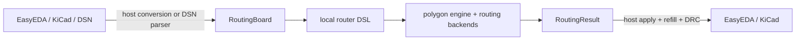

# EDA-neutral router package

Status: accepted direction
Date: 2026-08-13

The router is a separate product. EasyEDA `RawPcb`, EasyEDA `BoardAssemble`,
and the KiCad S-expression AST remain native host types and are not public
router data contracts.

`RoutingBoard` is the only internal board model used by the routing core. DSN
is a supported external interchange and backend transport, not the in-memory
working model. `RoutingResult` is the compact EDA-neutral result.

The package does not define `RawPcbV1`, `LegacyRawPcb`, `PcbSnapshotV1`, or
`PcbPatchV1`. It does not add schema/version fields to routing data before the
first public release. npm package versions are the distribution history.

The authoritative data contract is
[`routing-data-contract.md`](./routing-data-contract.md). The authoritative DSL
shape is [`router-dsl.md`](./router-dsl.md). DRC precedence is defined in
[`drc-rule-precedence.md`](./drc-rule-precedence.md).

The core never needs a live editor session. A host may construct
`RoutingBoard` directly or provide DSN. Native zone refill, native DRC, and
transactional application happen at the host boundary after routing.

External engines remain optional adapters. KRT currently consumes a temporary
KiCad board, Freerouting consumes DSN/SES, and EasyEDA WASM consumes its own
router input. Each adapter translates from the same `RoutingBoard` and returns
the same `RoutingResult` copper model.

Migration must preserve the current Powerbank regression before replacing the
existing file-based workflow. Package exports and CLI are finalized only after
the four contracts `RoutingBoard`, `RoutingCopper`, `RoutingRules`, and
`RoutingResult` are implemented and exercised by the existing backends.
