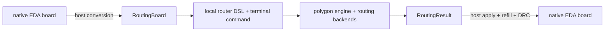

# EDA-neutral router package

Status: accepted direction
Date: 2026-08-13

The router is a separate product. Native EDA document models remain host types
and are not public router data contracts.

`RoutingBoard` is the only internal board model used by the routing core.
`RoutingResult` is the compact EDA-neutral result.

The package does not define `RawPcbV1`, `LegacyRawPcb`, `PcbSnapshotV1`, or
`PcbPatchV1`. It does not add schema/version fields to routing data before the
first public release. npm package versions are the distribution history.

The authoritative data contract is
[`routing-data-contract.md`](./routing-data-contract.md). The authoritative DSL
shape is [`router-dsl.md`](./router-dsl.md). DRC precedence is defined in
[`drc-rule-precedence.md`](./drc-rule-precedence.md).

The core never needs a live editor session. A host constructs `RoutingBoard`.
Native zone refill, native DRC, and transactional application happen at the
host boundary after routing.

The public package operation is `run(...)`. Inside the DSL,
`applyDrcRules()`, `applyStackup()`, `runCopper()`, `runRouting()`, and `runAll()` only select what that operation
does and return no value themselves. `RoutingResult` is returned by `run(...)`,
not by a DSL command.

Before a trace backend runs, compact power polygons are planned inside the core
and attached to a transient fixed-copper view. Backends also
receive `preconnectedPadGroups`, so pads already connected by a compact polygon
are not routed again. The returned `RoutingResult.copper` always contains the
planned zones/vias even when an external engine returns only tracks and vias.
Such a backend must declare and test both `preserve-fixed-copper` and
`fixed-zone-obstacles`; retaining a zone object without routing around its
occupied region is not sufficient.

Board-wide planes and stitching vias are planned after trace routing, using the
returned tracks/vias as obstacles. This keeps a GND plane from blocking the
route search while retaining polygon-first ownership for compact power copper.

KRT is the default engine for `run()` and the standalone KiCad path. EasyEDA
hosts may instead select the Hybrid strategy, which composes the unchanged KRT
leaf backend with bundled EasyEDA WASM behind the same `RouterBackendAdapter`
contract. The router-owned codec materializes KRT's temporary KiCad board and
returns the portable `RoutingResult` copper model. Host integrations neither
construct nor override that codec. The npm package does not expose native EDA
structures or the private polygon geometry scene. The accepted baseline details
are recorded in
[`accepted-cleanup-and-standalone-direction.md`](./accepted-cleanup-and-standalone-direction.md).
